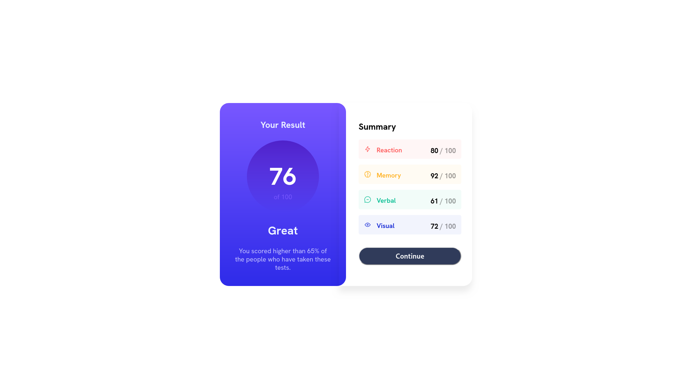

# Frontend Mentor - Results summary component solution

This is a solution to the [Results summary component challenge on Frontend Mentor](https://www.frontendmentor.io/challenges/results-summary-component-CE_K6s0maV). Frontend Mentor challenges help you improve your coding skills by building realistic projects. 

## Table of contents

- [Overview](#overview)
  - [Screenshot](#screenshot)
  - [Links](#links)
- [My process](#my-process)
  - [Built with](#built-with)
  - [What I learned](#what-i-learned)
  - [Continued development](#continued-development)
- [Author](#author)
## Overview

### Screenshot



### Links

- Solution URL: [GitHub](https://github.com/chkg2a/FRMentor-Results-summary)
- Live Site URL: [Netlify Live Preview](https://chk-result-summary.netlify.app/)

## My process

### Built with

- Semantic HTML5 markup
- CSS custom properties
- Flexbox
- [React](https://reactjs.org/) - JS library

### What I learned

This is essentially my first time building a project as It's been many years ago since I've made a website. I used ReactJs for this proect, I don't remember much css but I'm also doing [TheOdinProject](https://www.theodinproject.com/) on the side, fundamental knowledge from the TheOdinProject is helping me alot in this project

I dabble with some new css properties
```css
.container{
  box-shadow: 0 16px 16px hsl(0deg 0% 0% / 0.075);
}
```
```css
.container {
    min-height: 47vh;
    max-width: 370px;
    background: linear-gradient(hsl(252, 100%, 67%), hsl(241, 81%, 54%));

@media (max-width: 750px) {
  .container-box {
    flex-wrap: wrap;
  }

  .summary-container {
    box-shadow: none;
  }
}
```
Learned about media queries
```css
@media (max-width: 750px) {
  .container-box {
    flex-wrap: wrap;
  }

  .summary-container {
    box-shadow: none;
  }
}

```
Learned about pseudo element
```css

.score-box h3::after {
  content: " / 100";
  color: hsla(0, 0%, 0%, 0.4);
}
}
```
### Continued development
I'm still very new to this. But I'm willing to push on forwards. As there is so many interesting things to build. I'll try many projects from [frontendmentor.io](https://www.frontendmentor.io)


## Author

- Website - [ChK](https://chkxrenne.xyz)
- Frontend Mentor - [@chkg2a](https://www.frontendmentor.io/profile/chkg2a)

